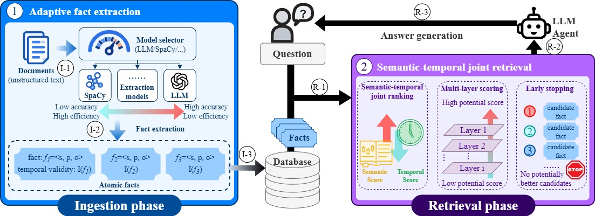

# JST-RAG

JST-RAG is a RAG system that improves QA accuracy while maintaining efficient ingestion and fact retrieval. In has two main components:



- **Ingestion — `spacy_llm_hybrid` constructor.** A logistic-regression  *selector* routes every document to either a free, local **spaCy** triple extractor or an **LLM (llama3.2 via Ollama)** extractor, so only the documents that genuinely need an LLM incur LLM cost.
- **Retrieval — `JSTRetriever`.** BM25 recall → temporal-coefficient scoring →  **T(temporal) × C(rank) dual-axis partitioning** → diagonal cascade levels  with sliding-window semantic reranking → dominance-gated early stopping →  top-k documents.

The RAG system class is `JSTRAGSystem` and the benchmark entry point is `scripts/run_benchmark_jstrag.py`.

---

## Repository layout

```
edbt-JST-RAG/
├── configs/
│   └── jstrag_default.yaml          # Default config (LLM, extractor, systems.jstrag, evaluation)
├── data/                             # Datasets and generated SQLite database files
├── models/                           # Model files (selector and cross-encoder reranker)
├── scripts/
│   ├── run_benchmark_jstrag.py                  # Python benchmark entry point (argparse)
│   ├── run_benchmark_jstrag_timeqa.sh           # Wrapper: TimeQA
│   ├── run_benchmark_jstrag_tempevalrag.sh      # Wrapper: TempEval-RAG
│   ├── run_benchmark_jstrag_situatedqa.sh       # Wrapper: SituatedQA
│   ├── _benchmark_common.py                     # Shared evaluation orchestration
│   └── utils/
│       └── train_spacy_suitability_classifier.py  # Train the spaCy/LLM selector
├── tcrag/                            # Main Python package
│   ├── config.py                     # YAML config loading and dataclasses
│   ├── utils.py                      # Shared helpers (e.g. FTS5 query sanitization)
│   ├── pipeline.py                   # End-to-end pipeline glue
│   ├── logging_config.py             # Logging setup
│   ├── rag_systems/
│   │   ├── base.py                   # BaseRAGSystem interface
│   │   └── jst_system.py             # JSTRAGSystem
│   ├── constructors/
│   │   ├── base.py                   # DocumentConstructor interface + factory registry
│   │   └── spacy_llm_hybrid.py       # spaCy/LLM hybrid constructor (self-registered)
│   ├── retrievers/
│   │   ├── metriever.py              # MRAG baseline retriever (temporal-semantic reranking)
│   │   └── jstretriever.py           # JSTRetriever + create_jst_retriever factory
│   ├── extractors/                   # Fact extractors
│   │   ├── spacy_extractor.py        # Local spaCy triple extractor
│   │   ├── extractor_wrapper.py      # Duck-type adapter for nuggetindex
│   │   ├── ni_llm_placeholder.py     # Placeholder-validity LLM extractor wrapper
│   │   ├── ni_ollama_compat.py       # Constrained-decoding Ollama client
│   │   └── ...
│   ├── llm/                          # LLM clients and factory (Ollama / OpenAI)
│   ├── data/                         # Data models and dataset loaders
│   └── evaluation/                   # Evaluator, metrics, and report writers
└── reports/                          # Benchmark reports (JSON / Markdown / per-query CSV)
```

---

## Prerequisites

### 1. Pull the LLM with Ollama

Install and start [Ollama](https://ollama.com/), then pull the model used both
for the LLM extraction branch and for QA answer generation:

```bash
ollama serve          # if the Ollama daemon is not already running
ollama pull llama3.2
```

Verify it is reachable at `http://localhost:11434`.

### 2. Train the spaCy/LLM selector

The hybrid constructor decides per document whether spaCy extraction is good
enough, using a logistic-regression classifier. Train it with:

```bash
conda activate tcrag     # see step 4; Ollama must be running

python scripts/utils/train_spacy_suitability_classifier.py \
    --datasets timeqa,tempevalrag \
    --label-gap-threshold 6 \
    --model-out models/spacy_suitability_logreg_th6.joblib
```


### 3. Download a cross-encoder reranker

To use the cross-encoder `ms-marco-MiniLM-L6-v2`, either
clone it locally (requires [Git LFS](https://git-lfs.com/)):

```bash
git lfs install
git clone https://huggingface.co/cross-encoder/ms-marco-MiniLM-L6-v2 \
    models/ms-marco-MiniLM-L6-v2
```

or let `sentence-transformers` download it automatically on first use by
referring to its Hugging Face id `cross-encoder/ms-marco-MiniLM-L6-v2`.

Then point the retriever at it through environment variables:

```bash
export RERANKER_TYPE=cross_encoder
export RERANKER_MODEL=$PWD/models/ms-marco-MiniLM-L6-v2
# ...or, without a local clone:
# export RERANKER_MODEL=cross-encoder/ms-marco-MiniLM-L6-v2
```

If these variables are unset, the pipeline defaults to
`nvidia/NV-Embed-v2` (`RERANKER_TYPE=nv_embed`).

### 4. Prepare the Python environment and install dependencies

The reference environment is a conda environment named `tcrag` with
**Python 3.11** (the project itself is not packaged and relies on scripts
injecting the repository root into `sys.path`):

```bash
conda create -n tcrag python=3.11 -y
conda activate tcrag

# nuggetindex core library — clone from GitHub, then install in editable mode
git clone https://github.com/searchsim-org/nuggetindex
pip install -e ./nuggetindex

# PyTorch (match the CUDA build of the reference env: 2.6.0 + cu124)
pip install torch --index-url https://download.pytorch.org/whl/cu124

# NLP / ML stack
pip install transformers sentence-transformers spacy scikit-learn joblib \
            pandas pyyaml httpx openai langchain-openai datasets \
            FlagEmbedding ragas

# spaCy English model used by the spaCy extraction branch
python -m spacy download en_core_web_sm
```

Key dependencies: `nuggetindex` (fact store / FTS5 index / native retriever),
`torch`, `transformers`, `sentence-transformers`, `spacy` + `en_core_web_sm`,
`scikit-learn`, `joblib`, `pandas`, and `pyyaml`. `ragas` is only needed when
RAGAs metrics are enabled.

---

## Running the benchmark

Each dataset has a shell wrapper that fills in the config, dataset path,
format, and index path, and forwards any extra arguments:

```bash
conda activate tcrag

# Small trial: 20 passages ingested, 5 queries, retrieval only (no QA calls)
bash scripts/run_benchmark_jstrag_timeqa.sh \
    --passage-limit 20 --query-limit 5 --no-qa

# First full run: build the hybrid index + full evaluation (takes several
# hours; only roughly 15–20% of documents are routed to the LLM)
bash scripts/run_benchmark_jstrag_timeqa.sh

# Later runs: reuse the built index and skip ingestion
bash scripts/run_benchmark_jstrag_timeqa.sh --reuse-db --no-qa
```

The other wrappers work identically:

```bash
bash scripts/run_benchmark_jstrag_tempevalrag.sh
bash scripts/run_benchmark_jstrag_situatedqa.sh
```

Reports (JSON summary, Markdown report, and per-query detail CSV with
`--per-query`) are written to `reports/`. When a run starts without
`--reuse-db`, an existing index at the target path is backed up to
`<name>.bak.<timestamp>.db` rather than deleted.
